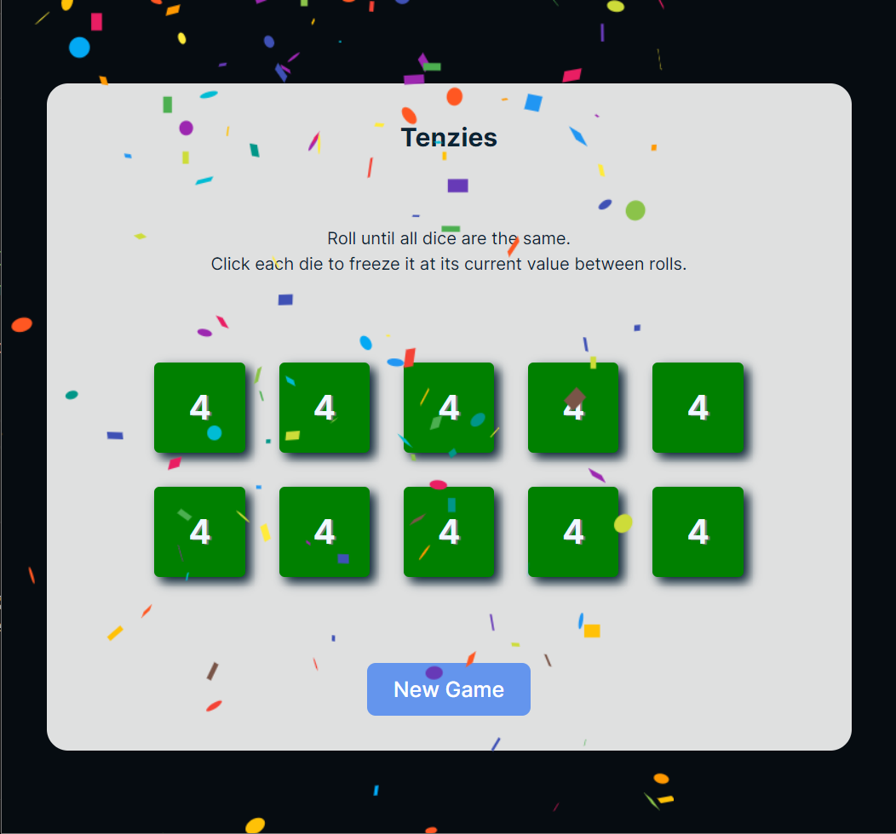

<!-- TABLE OF CONTENTS -->

  <!-- You are encouraged to replace this logo with your own! Otherwise you can also remove it. -->
  
   

# 📗 Table of Contents

- [📖 About the Project](#about-project)
  - [🛠 Built With](#built-with)
    - [Tech Stack](#tech-stack)
    - [Key Features](#key-features)
  - [🚀 Live Demo](#live-demo)

<!-- PROJECT DESCRIPTION -->

# 📖 [Tenzies Game] 

>Tenzies Game is a project built using React/Typscript that simulates the real-world Tenzies Game.

## 🛠 Built With <a name="built-with">React</a>

### Tech Stack <a name="tech-stack">React/TS</a>

> This is a Front End application that only uses React + LocalStorage

  
Client

  <ul>
    <li><a href="https://reactjs.org/">React.js</a></li>
  </ul>

Database

  <ul>
    <li><a href="">LocalStorage</a></li>
  </ul>

<!-- LIVE DEMO -->

## 🚀 Live Demo 

> Add a link to your deployed project.

- [Live Demo Link](https://tenzies-game-phi-eight.vercel.app/)

(<a href="#readme-top">back to top</a>)

